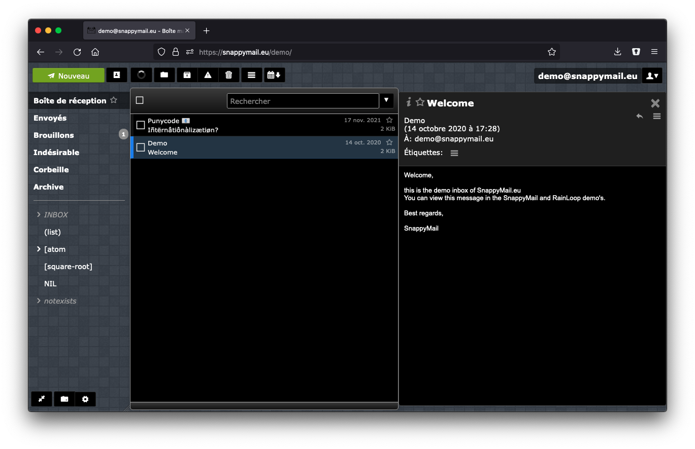

<!--
Este archivo README esta generado automaticamente<https://github.com/YunoHost/apps/tree/master/tools/readme_generator>
No se debe editar a mano.
-->

# SnappyMail para Yunohost

[](https://ci-apps.yunohost.org/ci/apps/snappymail/)  

[](https://install-app.yunohost.org/?app=snappymail)

*[Leer este README en otros idiomas.](./ALL_README.md)*

> *Este paquete le permite instalarSnappyMail rapidamente y simplement en un servidor YunoHost.*  
> *Si no tiene YunoHost, visita [the guide](https://yunohost.org/install) para aprender como instalarla.*

## Descripción general

Simple, modern, lightweight & fast web-based email client. The drastically upgraded & secured fork of RainLoop Webmail Community edition.


**Versión actual:** 2.36.3~ynh3

**Demo:** <https://snappymail.eu/demo/>

## Capturas



## Documentaciones y recursos

- Sitio web oficial: <https://snappymail.eu/>
- Documentación administrador oficial: <https://github.com/the-djmaze/snappymail/wiki>
- Repositorio del código fuente oficial de la aplicación : <https://github.com/the-djmaze/snappymail>
- Catálogo YunoHost: <https://apps.yunohost.org/app/snappymail>
- Reportar un error: <https://github.com/YunoHost-Apps/snappymail_ynh/issues>

## Información para desarrolladores

Por favor enviar sus correcciones a la [`branch testing`](https://github.com/YunoHost-Apps/snappymail_ynh/tree/testing

Para probar la rama `testing`, sigue asÍ:

```bash
sudo yunohost app install https://github.com/YunoHost-Apps/snappymail_ynh/tree/testing --debug
o
sudo yunohost app upgrade snappymail -u https://github.com/YunoHost-Apps/snappymail_ynh/tree/testing --debug
```

**Mas informaciones sobre el empaquetado de aplicaciones:** <https://yunohost.org/packaging_apps>
